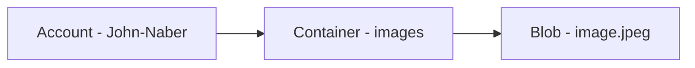

# Azure Cosmosdb
- Perform operations using SDK for cosmosdb (read/write)
- Configure and work with RUs (request units)
- Consistency levels : 
  - Be familiar with how 
  - When to use which replication level
    - `Strong`: happens to all replicas immediately
    - `Bounded` staleness: set maximum amount of time to lag from time the write accours until it is read
    - `Session`: all reads/writes are the same for the same session (especially when they share the same session token), apps that doesn't have the same session will have `Eventual` consistency
    - `Consistent prefix`: Allows delays when replicating, but ensures writes happen in all replicas in same exact order (no out of order writes).
    - `Eventual`: will write the data in all replicas "eventually". doesn't guarantee the order.
  - Costs:
    - | Level    | Costs  |
      |----------|--------|
      | Eventual | Lowest |
      | Strong        |    Highest|
  - Use case scenarios:
  - | Level             | Use case                                                                   |
    |-------------------|----------------------------------------------------------------------------|
    | Eventual          | Likes within an application (so you don't worry about the order of the likes) |
    | Session           | E-commerce, social media apps and similar with persistent user connection  |
    | Bounded Staleness | Near real time apps (stock exchange etc)  |
    | Strong            | Financial transactions, Scheduling, Forecasting workloads|
### Change feed notifications
  - For processing the changed data from external applications
    - Enabled by DEFAULT
    - DELETE not activated
    - You can capture deletes by soft-delete
    
# Azure Blob Storage

- Set / Retrieve properties and metadata for blob resources using REST
  - Header format: x-ms-meta-name:string-value
  - Format URI for retrieving properties and metadata:
    - `Container` GET/HEAD https://myaccount.blob.core.windows.net/mycontainer?restype=container
    - `Blob` GET/HEAD https://myaccount.blob.core.windows.net/myblob?comp=metadata
  - Format URI for different containers:
    - `Container` PUT https://myaccount.blob.core.windows.net/mycontainer?restype=container
    - `Blob` PUT https://myaccount.blob.core.windows.net/myblob?comp=metadata
  - Common properties
    - E-tag
    - Last-modified
- Client library for Java
  - Know how to read/write data using classes
  - | Class         | .Net Equivalent     |  Description  |
    |---------------------|----|--------------------------------------------------|
    | BlobServiceClient     | BlobServiceClient   | Manipulate storage resources and blob containers             |
    | BlobServiceClientBuilder| BlobClientOptions   | Config and installation of BlobServiceClient objects         |
    | BlobContainerClient      | BlobContainerClient | Manipulate containers and its blobs                          |
    | BlobClient               | BlobClient          | Manipulate storage blobs                                     |
    | BlobItem                 | ?                   | Returned object for Individual blobs returned from listBlobs |


### Blob resource diagram

  
### Blob storage lifecycle
  - `Hot`: Frequently access
  - `Cool`: Less frequent
  - `Archive`: Rarely accessed
  - Policies to manage:
    - How to transfer from one storage to another
    - Delete when needed (⚠️ you need to activate `last access time tracking`)
    - Define rules to be run per day at the storage account level
    - Apply rules to containers or subset of blobs (using prefixes as filters)
    - Policy structure:
      - `name` (*)
      - `enabled` 
      - `type` (*)
      - `definition` (*)
    - Rules:
      - `filter-set` (which blobs is affected) and `action-set` (what actions to take)
    - ⚠️ MUST contain at least one rule.
    - Policy example:
      - ```json
        {
          "rules": [
          { 
            "name": "rule1", 
            "enabled": true,
            "type": "Lifecycle",
            "definition: {...}
          }
        }```
        
### Static site hosting in a storage account
  - How to release a static website
    - Configure Capabilities > Static website , select enabled
    - Specify index and error documents
    - In `$web` container's `Upload` icon and open `the Upload blob` pane
    - Select files and add files
    - Enable metrics with `Metrics` under `Monitor` section
        
### Creating SAS token or connection string containing SAS:
  - Go to storage account > Security + Networking > Shared access signature
  - You can also set start and expiry dates for the signatures
  - You can either pick up the SAS and create your own connection string, or use already existing connection string which you will see as soon as creating a SAS token.
  - 


### Uploading a document/image to blob
  - ⚠️ This project assumes you have created a resource group. 
    - Go to https://portal.azure.com 
    - Navigate to Resource Groups on the main panel or Search resources > Resource group
    - Then click on `Create` , and give it a name (`REQUIRED`), you can leave the rest as empty
  - ⚠️ This project assumes you have created a storage account (can be empty).
    - Go to https://portal.azure.com
    - Navigate to the resource group that you created above.
    - Click on `Create` at the top left.
    - This will navigate you to the marketplace, where you can search for `Storage Account`
    - ⚠️ Make sure the creation module has selected your resource group correctly, if not make sure to select the one you created above.
  - ⚠️ This project assumes you have created a shared access signature from the storage account you have created. See: [Creating SAS Token](#creating-sas-token-or-connection-string-containing-sas)
  - Open up the cosmosdb-blob-collection.json in postman.
  - ⚠️ First fire the `BLOB - create container` request, this will create a container for you, and it is a must. 
  - ⚠️ Make sure to select a proper file, then upload the image using `BLOB - upload a file` request.
  - 
  - ⚠️ You will be able to see the file, as I did, on azure blob container (that you created).
  - 


# Refs
- https://parveensingh.com/cosmosdb-consistency-levels/
- https://learn.microsoft.com/en-us/azure/cosmos-db/use-cases

# Getting Started

## Running the application locally
* Make sure to create your own application.properties from application-template.properties and put it under `src/main/resources`
* Make sure to update the property `com.cosmos.connectionStringWithSA`
* If you would like to upload images greater than 1MB, then you need to update the following properties:
  * `spring.servlet.multipart.max-file-size`: the maximum file size in the backend
  * `spring.servlet.multipart.max-request-size` : accepted request size

### Reference Documentation

For further reference, please consider the following sections:

* [Official Gradle documentation](https://docs.gradle.org)
* [Spring Boot Gradle Plugin Reference Guide](https://docs.spring.io/spring-boot/docs/3.3.0/gradle-plugin/reference/html/)
* [Create an OCI image](https://docs.spring.io/spring-boot/docs/3.3.0/gradle-plugin/reference/html/#build-image)
* [Azure Cosmos DB](https://microsoft.github.io/spring-cloud-azure/current/reference/html/index.html#spring-data-support)
* [Spring Web](https://docs.spring.io/spring-boot/docs/3.3.0/reference/htmlsingle/index.html#web)

### Guides

The following guides illustrate how to use some features concretely:

* [How to use Spring Boot Starter with Azure Cosmos DB SQL API](https://aka.ms/spring/msdocs/cosmos)
* [Building a RESTful Web Service](https://spring.io/guides/gs/rest-service/)
* [Serving Web Content with Spring MVC](https://spring.io/guides/gs/serving-web-content/)
* [Building REST services with Spring](https://spring.io/guides/tutorials/rest/)

### Additional Links

These additional references should also help you:

* [Gradle Build Scans – insights for your project's build](https://scans.gradle.com#gradle)
* [Azure Cosmos DB Sample](https://aka.ms/spring/samples/latest/cosmos)

