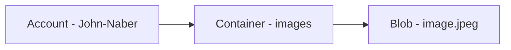
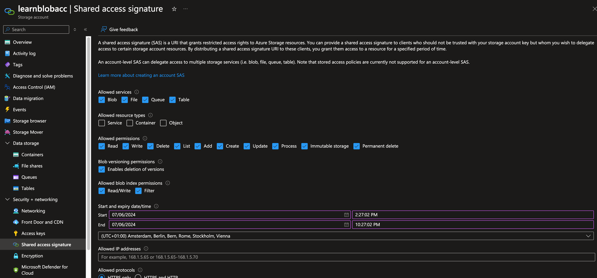
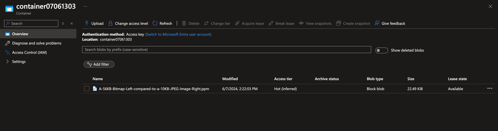
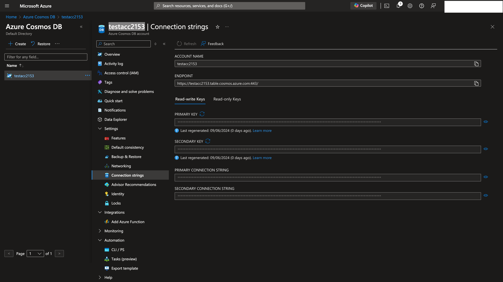
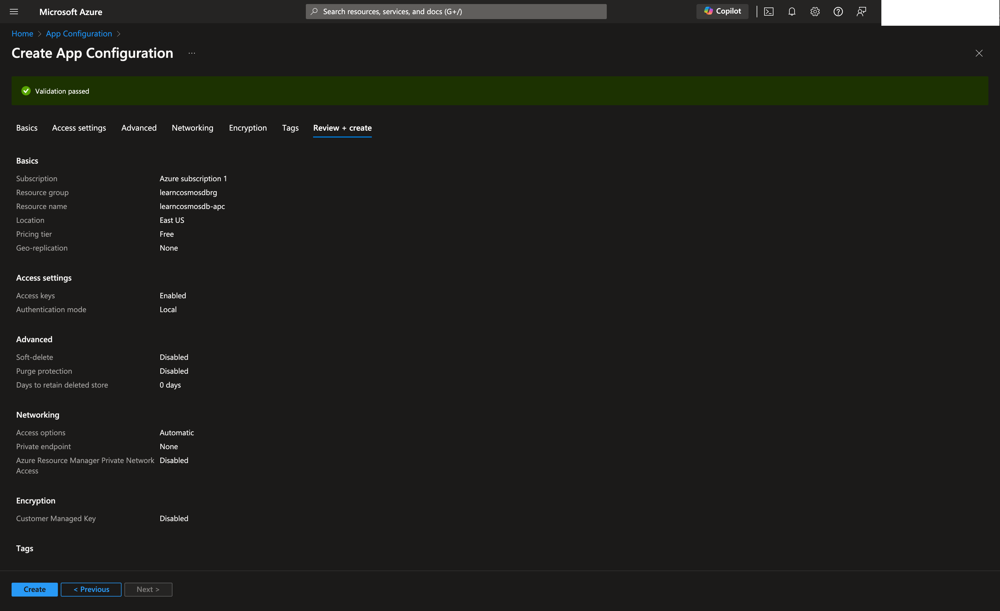

# READ ME FIRST
- [Disclaimer](#disclaimer-text)
# Azure Cosmosdb
- Perform operations using SDK for cosmosdb (read/write)
- Configure and work with RUs (request units)
- Consistency levels : 
  - Be familiar with how 
  - When to use which replication level
    - `Strong`: happens to all replicas immediately
    - `Bounded staleness` <b>DEFAULT</b>: set maximum amount of time to lag from time the write accours until it is read
    - `Session`: all reads/writes are the same for the same session (especially when they share the same session token), apps that doesn't have the same session will have `Eventual` consistency
    - `Consistent prefix`: Allows delays when replicating, but ensures writes happen in all replicas in same exact order (no out of order writes).
    - `Eventual`: will write the data in all replicas "eventually". doesn't guarantee the order.
  - Costs:
    - | Level    | Costs  |
      |----------|--------|
      | Eventual | Lowest |
      | Strong        |    Highest|
  - Use case scenarios:
  - | Level             | Use case                                                                   |
    |-------------------|----------------------------------------------------------------------------|
    | Eventual          | Likes within an application (so you don't worry about the order of the likes) |
    | Session           | E-commerce, social media apps and similar with persistent user connection  |
    | Bounded Staleness | Near real time apps (stock exchange etc)  |
    | Strong            | Financial transactions, Scheduling, Forecasting workloads|
### Change feed notifications
  - For processing the changed data from external applications
    - Enabled by DEFAULT
    - DELETE not activated
    - You can capture deletes by soft-delete
    
# Azure Blob Storage

- Set / Retrieve properties and metadata for blob resources using REST
  - Header format: x-ms-meta-name:string-value
  - Format URI for retrieving properties and metadata:
    - `Container` GET/HEAD https://myaccount.blob.core.windows.net/mycontainer?restype=container
    - `Blob` GET/HEAD https://myaccount.blob.core.windows.net/myblob?comp=metadata
  - Format URI for different containers:
    - `Container` PUT https://myaccount.blob.core.windows.net/mycontainer?restype=container
    - `Blob` PUT https://myaccount.blob.core.windows.net/myblob?comp=metadata
  - Common properties
    - E-tag
    - Last-modified
- Client library for Java
  - Know how to read/write data using classes
  - | Class         | .Net Equivalent     |  Description  |
    |---------------------|----|--------------------------------------------------|
    | BlobServiceClient     | BlobServiceClient   | Manipulate storage resources and blob containers             |
    | BlobServiceClientBuilder| BlobClientOptions   | Config and installation of BlobServiceClient objects         |
    | BlobContainerClient      | BlobContainerClient | Manipulate containers and its blobs                          |
    | BlobClient               | BlobClient          | Manipulate storage blobs                                     |
    | BlobItem                 | ?                   | Returned object for Individual blobs returned from listBlobs |


### Blob resource diagram

  
### Blob storage lifecycle
  - `Hot`: Frequently access
  - `Cool`: Less frequent
  - `Archive`: Rarely accessed
  - Policies to manage:
    - How to transfer from one storage to another
    - Delete when needed (⚠️ you need to activate `last access time tracking`)
    - Define rules to be run per day at the storage account level
    - Apply rules to containers or subset of blobs (using prefixes as filters)
    - Policy structure:
      - `name` (*)
      - `enabled` 
      - `type` (*)
      - `definition` (*)
    - Rules:
      - `filter-set` (which blobs is affected) and `action-set` (what actions to take)
    - ⚠️ MUST contain at least one rule.
    - Policy example:
      - ```json
        {
          "rules": [
          { 
            "name": "rule1", 
            "enabled": true,
            "type": "Lifecycle",
            "definition: {...}
          }
        }
        ```
        
### Static site hosting in a storage account
  - How to release a static website
    - Configure Capabilities > Static website , select enabled
    - Specify index and error documents
    - In `$web` container's `Upload` icon and open `the Upload blob` pane
    - Select files and add files
    - Enable metrics with `Metrics` under `Monitor` section
        
### Creating SAS token or connection string containing SAS:
  - Go to storage account > Security + Networking > Shared access signature
  - You can also set start and expiry dates for the signatures
  - You can either pick up the SAS and create your own connection string, or use already existing connection string which you will see as soon as creating a SAS token.
  - 


### Uploading a document/image to blob
  - ⚠️ This project assumes you have created a resource group. 
    - Go to https://portal.azure.com 
    - Navigate to Resource Groups on the main panel or Search resources > Resource group
    - Then click on `Create` , and give it a name (`REQUIRED`), you can leave the rest as empty
  - ⚠️ This project assumes you have created a storage account (can be empty).
    - Go to https://portal.azure.com
    - Navigate to the resource group that you created above.
    - Click on `Create` at the top left.
    - This will navigate you to the marketplace, where you can search for `Storage Account`
    - ⚠️ Make sure the creation module has selected your resource group correctly, if not make sure to select the one you created above.
  - ⚠️ This project assumes you have created a shared access signature from the storage account you have created. See: [Creating SAS Token](#creating-sas-token-or-connection-string-containing-sas)
  - Open up the cosmosdb-blob-collection.json in postman.
  - ⚠️ First fire the `BLOB - create container` request, this will create a container for you, and it is a must. 
  - ⚠️ Make sure to select a proper file, then upload the image using `BLOB - upload a file` request.
  - 
  - ⚠️ You will be able to see the file, as I did, on azure blob container (that you created).
  - 


# Refs
- https://parveensingh.com/cosmosdb-consistency-levels/
- https://learn.microsoft.com/en-us/azure/cosmos-db/use-cases

# Getting Started

## Running the application locally
* Make sure to create your own application.properties from application-template.properties and put it under `src/main/resources`
* Make sure to update the property `com.cosmos.connectionStringWithSA`
* If you would like to upload images greater than 1MB, then you need to update the following properties:
  * `spring.servlet.multipart.max-file-size`: the maximum file size in the backend
  * `spring.servlet.multipart.max-request-size` : accepted request size


### Reference Documentation

For further reference, please consider the following sections:

* [Official Gradle documentation](https://docs.gradle.org)
* [Spring Boot Gradle Plugin Reference Guide](https://docs.spring.io/spring-boot/docs/3.3.0/gradle-plugin/reference/html/)
* [Create an OCI image](https://docs.spring.io/spring-boot/docs/3.3.0/gradle-plugin/reference/html/#build-image)
* [Azure Cosmos DB](https://microsoft.github.io/spring-cloud-azure/current/reference/html/index.html#spring-data-support)
* [Spring Web](https://docs.spring.io/spring-boot/docs/3.3.0/reference/htmlsingle/index.html#web)

### Guides

The following guides illustrate how to use some features concretely:

* [How to use Spring Boot Starter with Azure Cosmos DB SQL API](https://aka.ms/spring/msdocs/cosmos)
* [Building a RESTful Web Service](https://spring.io/guides/gs/rest-service/)
* [Serving Web Content with Spring MVC](https://spring.io/guides/gs/serving-web-content/)
* [Building REST services with Spring](https://spring.io/guides/tutorials/rest/)

### Additional Links

These additional references should also help you:

* [Gradle Build Scans – insights for your project's build](https://scans.gradle.com#gradle)
* [Azure Cosmos DB Sample](https://aka.ms/spring/samples/latest/cosmos)

## Update 09.06.2024
## Partition key summary
- Not required for data under 10GB
- It is a placement handle to tell cosmosdb `How to` write and find the data
- We can write queries without a partition key, with `fanout query`
  - `fanout query`: You change your statements each time for filtering the results (for example, one for a customer's age, then customer's city), the database will first go through a more common node, but then each time the filter parameter change, it will start to look at each and every node!
- Since `fanout queries` doesn't scale, we will have bottlenecks or hit the limit of maximum amount of queries per single node
- We can scale : `READ`, `WRITE` and `STORAGE`.
  - `STORAGE`: Use X number of nodes , and you will use `fanout queries` to retrieve the data. 
    - (-) You will have `READ` bottlenecks (as we will ask each node where to find our data!)
  - `READ`: To scale, replicate the data for each of these nodes.
    - (-) You will have `WRITE` bottlenecks (as we will need to write to each and every node!).
  - `WRITE`: The only way to scale writes is to `SHARD` or `PARTITION` the data.
- To scale easier on these kinds of scenarios, it is suggested to have `partition_key`.
- Best practices to choose a `partition_key`:
  - Understand the ratio of reads and writes: 
    - if your application is reading more than writing to the database, `optimize for frequency`.
    - if your application is writing more than reading from the database, `load balance`.
  - Example of a bad partition key: 
    - Suppose you have an IoT system, You would get 10000 requests coming in to your database at the same time.
        - If you choose `creation_timestamp` as the partition key, then you would end up getting write bottlenecks, as you will write to the same node and as the timestamp would be very similar and won't make sense.
        - If you choose `device_id` as the partition key, the database will know exactly where to put the data to which node. So reads and writes will be easier.
  - Look for the dataset and try to find the most common field (it shouldn't be unique id or non changing field)
    - In the example of IoT, check `where` clause of most run queries, and you would see the `device_id` show up, then it would be a good partition key for your usecase.
## Cosmosdb integration with spring boot
- ⚠️ To be honest, I wasn't able to see the data on Data explorer. However, I was able to see the data when I ran postman collection locally.
- ⚠️ This project assumes you have created a resource group.
- ⚠️ This project assumes you have created a cosmosdb `table` database.
  - Go to your resource group and select `Create`
  - In marketplace search for `cosmos db table` and create the database with any given account name.
  - Once you create entities using postman, the database will be created automatically.
- ⚠️ You're expected to provide the following properties in your application.properties file.
```properties
spring.cloud.azure.cosmos.endpoint=https://contosoaccounttest.documents.azure.com:443/
spring.cloud.azure.cosmos.key=your-cosmosdb-primary-key
spring.cloud.azure.cosmos.database=contosoaccounttest
```
- Activate the cosmosdb repositories with : `@EnableCosmosRepositories`
- Create a repository with `CosmosRepository` (see also `CosmosReactiveRepository` for reactive operations).

## Where to get connection properties?
- Go to DB Account > Settings > Connection Strings
- Note down endpoint , key (primary key) and the name of the database that you have created. And replace the values of the properties above.
  


## Interacting with azure cloud database
- Please find the sample date under [resources](/src/main/resources/static/sample-data.json)
- There are 4 endpoints in place for you test,
- `create customer`: to create a customer
- `get customer`: to get the created customer
- `get all customers`: to get all customers
- `get all customers by country`: to filter customers by country
```properties
spring.cloud.azure.cosmos.endpoint=https://contosoaccounttest.documents.azure.com:443/
spring.cloud.azure.cosmos.key=your-cosmosdb-primary-key
spring.cloud.azure.cosmos.database=contosoaccounttest
```


## Refs
- https://www.youtube.com/watch?v=QLgK8yhKd5U&list=PLmamF3YkHLoLLGUtSoxmUkORcWaTyHlXp

## Update 13.06.2024
## App config summary
- The app config service is there to keep your credential information, connection strings, and anything related to your service.
- Once you set it up, you can also use the credentials from key-vault service or move already existing credentials from your app config service to key vault, to add extra level of security and encryption.
- More importantly, you can use it to store your feature flags!
- To create the service, simply reuse the resource group you created and select mostly the default settings:
  

## Alternative ways to add your keys to App Configuration service
### 1. Operations / Import
- ⚠️ Imports with yaml files are not very convenient (aka. NOT WORKING!) ⚠️
- Simply go to Operations > Import > Source: Configuration file
- Select the configuration file to be uploaded (json or properties)
- Select the language (in our case spring)
- Select the prefix, in our case we need /application


### 2. Creating keys manually
- Go to Operations > Configuration Explorer
- After that you can create key values using the following format:
```properties
/application/spring.cloud.azure.cosmos.endpoint
/application/spring.cloud.azure.cosmos.key
/application/spring.cloud.azure.cosmos.database
```
(you can also add other properties like this too.)

## Building & Running the application locally
- You will need to add following dependency:
```properties
implementation("com.azure.spring:spring-cloud-azure-starter-appconfiguration-config")
```
- ⚠️ You will need to rename your application.properties file to **bootstrap.properties** (because azure properties really doesn't like application.yaml or application.property files!) ⚠️
- Get the connection properties under Settings > Connection string - you can use read/write or read only keys.
- et voila! you will be using your application without any extra property defined in your local environment, AND it is FREE 🤩 !

## Refs
- https://learn.microsoft.com/en-us/samples/azure-samples/azure-spring-boot-samples/managing-features-and-get-configurations-from-app-configuration-in-spring-boot-application/

### Disclaimer Text
The sample data provided in this repository, including but not limited to names, addresses, phone numbers, and email addresses, are entirely fictional. Any resemblance to real persons, living or dead, actual addresses, phone numbers, or email addresses is purely coincidental.

I do not bear any responsibility for any coincidental matches to real-world data and am not responsible for any related data issues. This data is meant solely for testing and demonstration purposes.